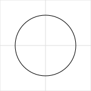
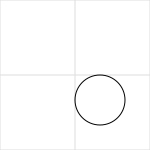
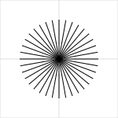
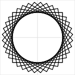
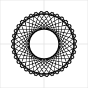

# Joy

Joy is a tiny creative coding library in Python.

## Installation

The easiest way to install it is download `joy.py` and place it in your
directory. The library has no dependencies. It can downloaded from:

<https://github.com/fossunited/joy/raw/main/joy.py>

## Coordinate System

Joy uses a canvas with `(0, 0)` as the center of the canvas.

By default, the size of the canvas is `(300, 300)`.

## Usage

The `Joy` library integrates well with Jupyter environment and it is
recommended to explore Joy in a Jupyter lab.

The first thing you need to do is import the module.

```python
from joy import *
```

Once the functionality in the module is imported, you can start playing
with it.

Let's start with a drawing a circle:

```
c = circle()
show(c)
```



By default circle will have center at `(0, 0)` and radius as `100`. But
you can specify different values.

```
c = circle(cx=50, cy=50, r=50)
show(c)
```



The other basic types that are supported are `line` and `rect`.

```
c = circle(cx=0, cy=0, r=50)
r = rect(x=-50, y=-50, width=100, height=100)
s = line(x1=-50, y1=-50, x2=50, y2=50)
show(c, r, s)
```


Joy supports transformations `translate`, `rotate` and `scale`.

```
r = rect(x=-50, y=-50, widht=100, height=100)
show(rotate(r, angle=45))
```

Joy comes with very interesting higher-order transformations. The `cycle`
function rotates a shape repeatedly.

```
cycle(line())
```



The above example, takes a line and rotates it around the origin 18
times and combines all the rotated shapes.

You could cycle a square:

```
cycle(rect())
```



or a rectangle:

```
r = rect(x=-100, y=-50, width=200, height=100)
cycle(r)
```



You could even shrink while doing the cycle:

```
r = rect(width=300, height=300)
shape = cycle(r, n=72, s=0.92)
show(shape)
```


You can try the same with a circle too:

```
c = circle(cx=100, cy=0, r=50)
shape = cycle(c, s=0.97, n=36*4, angle=10)
show(shape)
```


For more information, please checkout the [tutorial](tutorial.ipynb).

## Tutorial

See [tutorial.ipynb](tutorial.ipynb).

## License

This repository has been released under the MIT License.