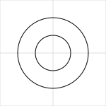
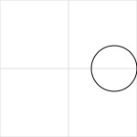
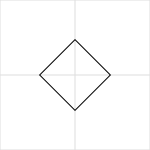
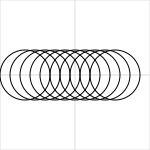
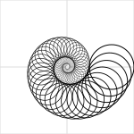

# Joy

Joy is a tiny creative coding library in Python.

## Installation

The easiest way to install it is download `joy.py` and place it in your
directory. The library has no dependencies.

It can be downloaded from:

<https://github.com/fossunited/joy/raw/main/joy.py>

## Coordinate System

Joy uses a canvas with `(0, 0)` as the center of the canvas.

By default, the size of the canvas is `(300, 300)`.

## Using Joy

The `Joy` library integrates well with Jupyter environment and it is
recommended to explore Joy in a Jupyter lab.

The first thing you need to do is import the module.

```python
from joy import *
```

Once the functionality in the module is imported, you can start playing
with it.

## Basic Shapes

Joy supports the basic shapes `circle`, `ellipse`, `rectangle` and `line`.

Let's start with a drawing a circle:

```
c = circle()
show(c)
```


By default circle will have center at `(0, 0)` and radius as `100`. But
you can specify different values.

```
c = circle(x=50, y=50, r=50)
show(c)
```


The other basic types that are supported are `ellipse`, `rectangle`,
and `line`:

```
s1 = circle()
s2 = ellipse()
s3 = rectangle()
s4 = line()
show(s1, s2, s3, s4)
```


## Combining Shapes

Joy supports `+` operator to join shapes.

```
def donut(x, y, r):
    c1 = circle(x=x, y=y, r=r)
    c2 = circle(x=x, y=y, r=r/2)
    return c1+c2

d = donut(0, 0, 100)
show(d)
```




## Transformations

Joy supports `translate`, `rotate` and `scale` transformations.
Transformations are applied using `|` operator.

```
shape = circle(r=50) | translate(x=100, y=0)
show(shape)
```



Transformations can be chained too.

```
r1 = rectangle(w=200, h=200)
r2 = r1 | rotate(angle=45) | scale(1/SQRT2)
show(r1, r2)
```


## Higher-Order Transformations

Joy supports higher-order transformation `repeat`.

The `repeat` transformation applies a transformation multiple times and
combines all the resulting shapes.

For example, draw 10 circles:

```
c = circle(x=-100, y=0, r=50)
shape = c | Repeat(10, Translate(x=10, y=0)
show(shape)
```



Combined with rotation, it can create amusing patterns.

```
shape = line() | repeat(18, rotate(angle=10))
show(shape)
```


We could do the same with a square:

```
shape = rectangle(w=200, h=200) | repeat(18, rotate(angle=10))
show(shape)
```


or a rectangle:

```
shape = rectangle(w=200, h=100) | repeat(18, rotate(angle=10))
show(shape)
```


We can combine multiple transformations and repeat.

```
shape = rectangle(w=300, h=300) | repeat(72, rotate(360/72) | scale(0.92))
show(shape)
```


You can try the same with a circle too:

```
c = circle(x=100, y=0, radius=50)
shape = c | repeat(36*4, rotate(10) | scale(0.97))
show(shape)
```


For more information, please checkout the [tutorial](tutorial.ipynb).

## Tutorial

See [tutorial.ipynb](tutorial.ipynb).

## Acknowledgements

Special thanks to Amit Kapoor (@amitkaps). This library woundn't have
been possible without his inputs.

The long discussions between @anandology and @amitkaps on functional
programming and computational artistry (for almost over an year) and the
[initial experiments](https://amitkaps.com/artistry) were some of the
seeds that gave life to this library.

## License

This repository has been released under the MIT License.
